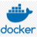

## Purpose
Ruby CLI Wrapper for AWS, Chef, Docker, Terraform, Helm, Kubectl and Packer. Can be used to build and deploy AWS and local resources. Somewhat, easy to add your own custom Terraform roles or Ruby rake tasks and libraries for own environments. The idea is to have one place to control many different infrastructure tools for multiple environments. One devops tool to rule them all! Also, a it's good code base to grab examples from to help you with our own custom projects.

### HowTo
* [Local Setup](./docs/howto/local_setup.md)
* [Usage](docs/howto/usage.md)
